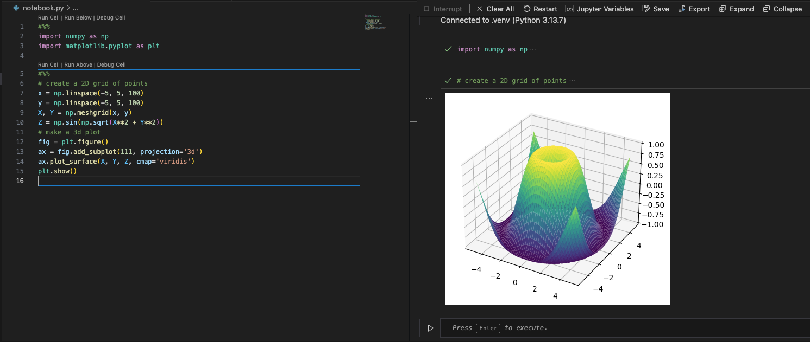

# Moderno progetto python con uv

Questo è un esempio di progetto Python moderno che utilizza `pyproject.toml` per la gestione delle dipendenze e la configurazione del progetto.
Include anche un semplice script Python con funzioni di esempio (annotate con tipi), docstrings in stile numpydoc, ed un esempio di uso di librerie esterne come `numpy` e `matplotlib`.

## Come eseguire

Clonare il repository e installare le dipendenze:

```bash
git clone <repository-url>
# creo il virtual environment conda, con preinstallato python3 ed uv
conda create --prefix .venv/ python=3 uv

# attivo il virtual environment 
conda activate .venv/

# inizializzo il progetto
uv sync
```

## Altri comandi utili

```bash
# eseguo il file main.py (questo comando installerà anche le dipendenze se non lo sono già)
uv run python main.py

# o in alternativa
python main.py

# apro visual studio code su questo progetto
code .


# esempio: installo altre librerie
uv add pandas

# esempio: install librerie di dev 
uv add --dev black
```

## come creare un nuovo progetto da zero

```bash
mkdir my-project
cd my-project

# creo il virtual environment conda, con preinstallato python3 ed uv
conda create --prefix .venv/ python=3 uv

# attivo il virtual environment 
conda activate .venv/

# inizializzo il progetto
uv init
```

## Note su visual studio code

Il progetto include una configurazione con le estensioni consigliate per VSCODE, che trovate in `.vscode/extensions.json`.
In questo caso ho incluso solo l'estensione ufficiale di Python di Microsoft, che fornisce supporto per linting, debugging, e altre funzionalità utili per lo sviluppo in Python.

Avendo l'estensione installata, VSCode dovrebbe riconoscere in automatico il virtual environment `.venv/` e usarlo per eseguire il codice Python. 
Se non lo facesse, potete selezionarlo manualmente premendo `Cmd+Shift+P` (Mac) o `Ctrl+Shift+P` (Windows/Linux) e cercando "Python: Select Interpreter", quindi scegliendo il percorso del vostro ambiente virtuale `.venv/`.

Il progetto include una semplice configurazione di debug che trovate in `.vscode/launch.json`. Per eseguire il debug, aprite il file `main.py`, andate nella sezione di debug di VSCODE e cliccate su "Run and Debug".
È possibile inserire breakpoint cliccando a sinistra del numero di riga nei file Python e poi controllare il flusso di esecuzione, ispezionare variabili, ecc.

Vi consiglio di impostare l'inglese come lingua di VSCODE, perchè è più facile trovare soluzioni online in caso di problemi.

## Modalità Notebook di VSCODE



È possibile eseguire il codice in modalità notebook direttamente in VSCODE. Questa modalità è simile a quella a disposizione nei Jupyter Notebook ed in MATLAB.
Basta aggiungere `# %%` tra le celle di codice. Per avere questa funzionalità è necessario installare il pacchetto `ipykernel` e `notebook` come dipendenza di sviluppo.

```bash
uv add --dev ipykernel notebook
```

Cliccando su una cella, è possibile eseguirla con il tasto "Run Cell" che appare sopra la cella, oppure con la scorciatoia `Shift+Enter`.
I risultati dell'esecuzione della cella verranno mostrati nella finestra interattiva che si apre a destra, come mostrato nell'immagine sopra.

La modalità notebook è molto utile per fare esperimenti veloci con il codice, perché permette di eseguire il codice cella per cella, visualizzare i risultati immediatamente e fare modifiche rapide in modalità interattiva.
